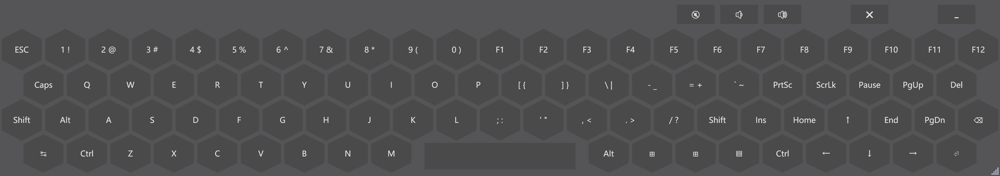

# FullKeyboardWin

## Overview

FullKeyboardWin is an virtual keyboard for Windows devices to input keys on a 87-key keyboard.

It follows the same design ideas from my Android virtual keyboard project [FullKeyboard](https://github.com/IanusInferus/FullKeyboard).

Recently, I have bought an Aya Neo. The two built-in virtual keyboard softwares from Microsoft have many drawbacks, which drives me to build this software.

## Functionality

The virtual keyboard is transparent, so it will not block any content below, nor will it change the window layout. It is also very compact and can be resized, which saves space on low resolution devices. It resides in the taskbar as a tray icon and doesn't use much taskbar space.

Holding on a key will trigger its keypress multiple times.

Press Win+Shift+O or Win+Ctrl+O to hide or show the virtual keyboard. As Win+Ctrl+O is taken by the old system virtual keyboard, it is needed to kill explorer.exe before starting FullKeyboardWin to register the hot key. You can also run `KillExplorerAndStart.cmd` to do it. This way, we can use the virtual keyboard key on Aya Neo.

## Limitation

The virtual keyboard will not show in full-screen applications, like the built-in ones.

The tray icon will draw window focus to it when pressed. Use the hardware virtual keyboard key on Aya Neo or your controller-keyboard mapper hotkey to workaround this problem.

It can not type to system process when started as a user process.

The virtual keyboard is always below the start menu.

## Development

The software is developed on WPF. It requires Windows and Visual Studio 2019 16.8.

## License

The software is licensed with 3-Clause BSD, see [LICENSE](LICENSE).
